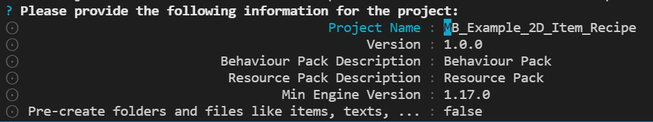
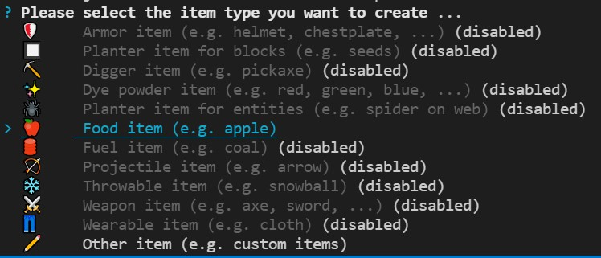
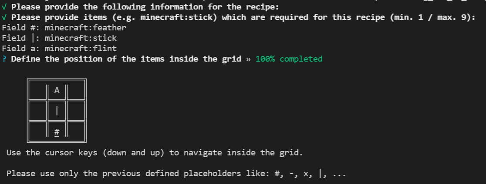

# Minecraft Bedrock Utils (Maintenance only!)

[](https://www.npmjs.org/package/minecraft-bedrock-utils)

[](https://nodei.co/npm/minecraft-bedrock-utils/)

The Minecraft Bedrock Utils simplify some of the manual tasks and allows a more
enjoying development experience.

## Features

Automatic detects the used behavior pack and/or resource pack based on the
_manifest.json_ file.

Easy and automatic creation of base files and _manifest.json_ files for new
projects.



## Installation (optional)

The easiest way is to keep minecraft-bedrock-utils as a Dependency in your
package.json, by running

```bash
npm install minecraft-bedrock-utils
```

If you are working on several projects it's recommend to install the
minecraft-bedrock-utils globally.

## Recommended structure

### Recommended structure for existing projects

The following folder structure is recommended for your projects.

- **Project Folder**
  - **Behavior Pack Folder**
    - manifest.json (for Minecraft)
  - **Resource Pack Folder**
    - manifest.json (for Minecraft)
  - **package.json** (for npm / default values)

You should execute the `npx minecraft-bedrock-utils <command>` command inside
the project folder and not directly inside a behavior pack or resource pack
folder.

### Recommended structure for new projects

The following folder structure is recommended for new projects.

- **Project Folder**
  - **package.json** (for npm)

Execute the command `npx minecraft-bedrock-utils init` and
`npx minecraft-bedrock-utils new` inside your empty project folder to
automatically create the recommend structure.

## How to use the utils

Use the **npx** command to run the utils with one of the commands in your
project folder.

## Commands

Commands are executed over the **npx** command for example
`npx minecraft-bedrock-utils <command>` inside the project folder.

### init

The init command prepares the workspace and installs a local copy of the needed
tools for offline usage.

Use the following command inside a empty folder:
`npx minecraft-bedrock-utils init`

After this was successful you should use the `npx minecraft-bedrock-utils new`
command to setup your new project.

### new

The new command creates a new project with the required folder and files. It
should be only used for new projects and will give you and error if there are
any existing behavior or resource packs.

To start a new project use `npx minecraft-bedrock-utils new` which will ask for
additional details like:


If you just want to add a basic project use the command
`npx minecraft-bedrock-utils new <name>` instead.

### add item

This commands adds a new items to the project with some default options.

Example: `npx minecraft-bedrock-utils add item`



### add recipe

This commands adds a new recipe to the project with some default options.

Example: `npx minecraft-bedrock-utils add recipe`



### run

The run commands copies the behavior pack and/or resource pack of the current
directory into the developer behavior pack and/or developer resource pack
folders.

After the step is done it tries to start Minecraft Bedrock, if it was not
already started.

Example: `npx minecraft-bedrock-utils run`

Note: Please make sure to reload the world after this step is done.

### copy

The copy commands copies the behavior pack and/or resource pack of the current
directory into the developer behavior pack and/or developer resource pack
folders.

Example: `npx minecraft-bedrock-utils copy`

### launch

Tries to start Minecraft Bedrock, if it was not already started.

Example: `npx minecraft-bedrock-utils launch`

### deploy

The deploy commands copies the behavior pack and/or resource pack of the current
directory into the behavior pack and/or resource pack folders to run it on a
multiplayer server.

Example: `npx minecraft-bedrock-utils copy`

### uuid

The uuid command returns a v4 UUID or v5 UUID string which could be used inside
the **manifest.json** file.

To get a basic v4 uuid use the following command:
`npx minecraft-bedrock-utils uuid`

To get an v5 uuid you need to provide a name and a corresponding namespace. If
no namespace is provided it will use a default namespace (for testing only!).

Example: `npx minecraft-bedrock-utils uuid <name> <namespace>`

### info

Shows basic information about the detected behavior and/or resource pack inside
the project folder.

Example: `npx minecraft-bedrock-utils info`

It's possible to add a path to this command to compare several projects like
`npx minecraft-bedrock-utils info <path>`

### debug

Shows some debug information mostly for troubleshooting like the detected path.

Example: `npx minecraft-bedrock-utils debug`

## Supported config options

To make things easier to maintain it's possible to pre-define some of the values
inside the _package.json_. These information are mostly used for creating new
project and items and have less relevant afterwards.

Example manifest.json:

```json
{
  ...
  "dependencies": {
    "minecraft-bedrock-utils": "^1.1.1"
  },
  "config": {
    "project_name": "Example 2D Item with Recipe",
    "project_folder_name": "MB_Example_2D_Item_Recipe",
    "project_namespace": "markusbordihn_examples"
  }
  ...
}
```

## Disclaimer

NOT OFFICIAL MINECRAFT PRODUCT. NOT APPROVED BY OR ASSOCIATED WITH MOJANG.
